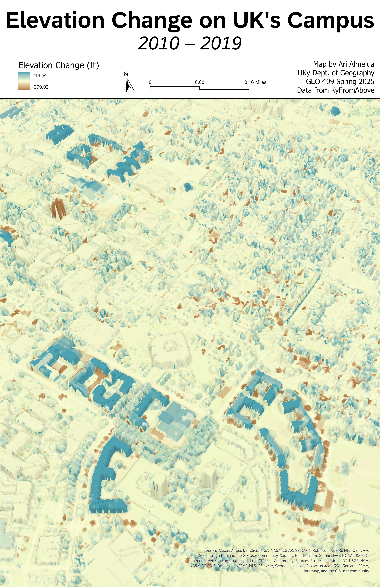

# Change on University of Kentucky's campus

## Map visualizing elevation change on University of Kentucky's campus and surrounding areas.

This map shows the change in elevation on the University of Kentucky's campus and surrounding areas between 2010 and 2019. Key changes include the construction of new dormitory buildings on campus, represented by the large blue clusters t the bottom of the map (Woodland Glen dorms) and the at the top (Holmes Hall, Jewell Hall, and Blazer Hall), as well as the student housing apartment complex at the very top left of the map, The Hub Lexington.

  
_Change in elevation around campus, centering William T. Young library._

[Link to high-resolution GeoPDF version](campus_change.pdf)

Author: Ari Almeida

Data Source: KyFromAbove lidar data (Phases 1 and 2, 2010 & 2019)

Map created for GEO 409, Spring 2025

April 13, 2025